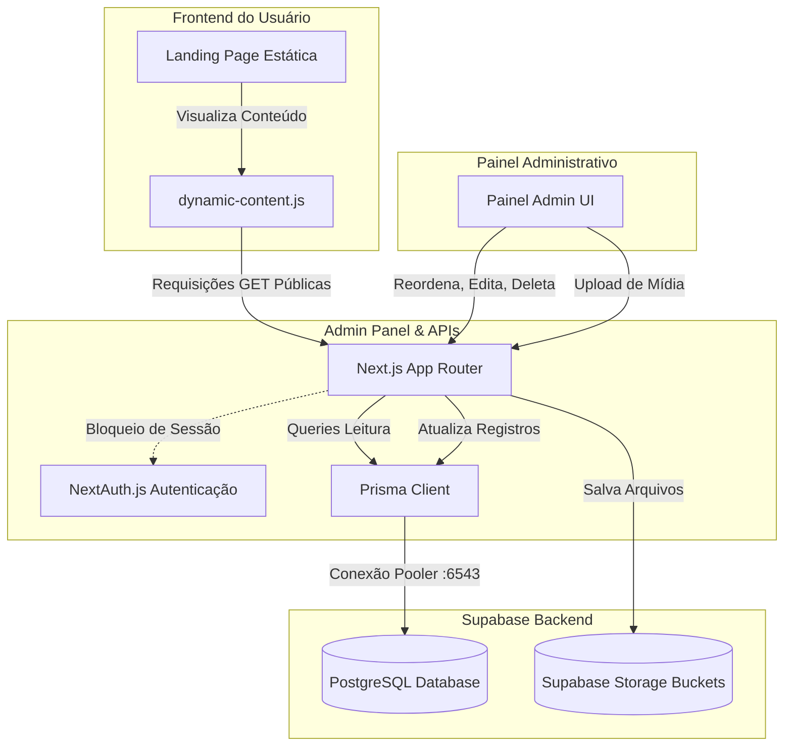

# Documentação Técnica: Arquitetura, Banco de Dados e Segurança

Esta documentação descreve de forma abrangente as decisões arquiteturais, especificações do banco de dados, políticas de segurança e integrações tecnológicas adotadas no projeto **Quinto Continente**.

---

## 1. Visão Geral da Arquitetura

O projeto adota um modelo híbrido para conciliar a simplicidade e o SEO de um site institucional estático com a robustez e dinamicidade de um painel de controle administrativo:



1. **Frontend Institucional (Estático):** Páginas HTML tradicionais com carregamento assíncrono via script JavaScript (`assets/js/dynamic-content.js`). Se o painel administrativo estiver offline, o site exibe o conteúdo estático original como fallback (Estratégia de Degradação Suave).
2. **Servidor Administrativo (Next.js):** Localizado no diretório `/admin`. Ele atua tanto como a interface de gerenciamento do cliente (Dashboard) quanto como o servidor de APIs de dados (`/api/banners`, `/api/artistas`, etc.) e upload de imagens.
3. **Persistência de Dados & Mídia (Supabase):** Banco de dados relacional PostgreSQL para dados estruturados e buckets públicos estruturados no Supabase Storage para armazenamento de arquivos de mídia (banners, fotos de artistas e imagens de eventos).

---

## 2. Stack Tecnológica Utilizada

Abaixo está o detalhamento técnico e a motivação para escolha de cada tecnologia no ecossistema da aplicação:

| Tecnologia | Categoria | Função no Projeto | Motivação e Benefício |
| :--- | :--- | :--- | :--- |
| **HTML5 / CSS3 / JS Vanilla** | Frontend Estático | Interface Institucional | Máxima indexabilidade (SEO) e velocidade de renderização no cliente sem overhead de JS. |
| **Next.js 14+ (App Router)** | Fullstack Framework | Painel de Controle e Backend de APIs | Roteamento nativo baseado em pastas, facilidade para criar Server Actions/APIs, suporte de alto nível na Vercel. |
| **TypeScript** | Linguagem | Tipagem Estática do Admin | Redução drástica de bugs em tempo de execução, garantindo contratos consistentes entre APIs e interface. |
| **Tailwind CSS** | Estilização CSS | UI do Painel Administrativo | Rapidez de desenvolvimento de layouts responsivos com CSS atômico e fácil customização para modo escuro. |
| **Prisma ORM** | Banco de Dados / ORM | Mapeamento Relacional e Queries | Tipagem autogerada com base no schema do banco, migrations automatizadas e facilidade de escrita de queries. |
| **NextAuth.js (v4)** | Autenticação | Controle de Sessão e login | Solução robusta e amplamente testada, criptografia de tokens baseada em JWT e persistência segura em cookies HTTP-Only. |
| **Zod** | Validação de Dados | Validação de formulários e APIs | Garante integridade absoluta dos dados antes de tocar no banco, tanto no frontend quanto no backend. |
| **bcryptjs** | Segurança | Hash de senhas de usuários | Armazenamento de credenciais de forma segura usando criptografia unidirecional lenta com 10 salt rounds. |
| **Supabase (PostgreSQL)** | Persistência | Banco de dados relacional | Banco PostgreSQL robusto com recursos modernos, suporte nativo a pooling via pgBouncer e interface simples. |
| **Supabase Storage** | Cloud Storage | Armazenamento de Imagens | Centralização de dados e arquivos de mídia na mesma conta do Supabase, com suporte a CDN nativo. |

---

## 3. Estrutura de Diretórios do Projeto

```
/ (Raiz)
├── index.html                      # Landing Page principal (estática)
├── artistas/
│   └── index.html                  # Página de listagem de artistas (estática)
├── galeria/
│   └── index.html                  # Página de galeria de fotos (estática)
├── assets/
│   ├── css/                        # Estilos do site institucional
│   └── js/
│       ├── main.js                 # JS original do site institucional
│       └── dynamic-content.js      # Integração dinâmica com o Painel Admin (Next.js)
├── robots.txt                      # Evita indexação global de pastas do admin em buscadores externos
├── docs/                           # Documentações técnicas e guias de deploy
│   ├── documentacao_tecnica.md     # Esta documentação técnica
│   ├── plano_deploy_vercel.md      # Guia de implantação rápida na Vercel
│   └── walkthrough.md              # Resumo histórico de modificações
│
└── admin/                          # Estrutura do Painel Administrativo Next.js
    ├── prisma/
    │   ├── schema.prisma           # Modelos de dados e definições de conexão Prisma
    │   └── seed.ts                 # Script de semeadura (cria administrador padrão)
    ├── public/                     # Arquivos estáticos públicos do Next.js
    ├── src/
    │   ├── components/             # Componentes modulares reutilizáveis (CRM, CRUDs)
    │   ├── lib/                    # Utilitários (Conexão DB, Configs de Auth, Schemas Zod)
    │   ├── types/                  # Sobrescritas e extensões de tipos TypeScript
    │   └── app/                    # Rotas, Páginas e endpoints de API (App Router)
    │       ├── api/                # Endpoints REST (auth, upload, banners, artistas, galeria, leads)
    │       ├── dashboard/          # Páginas restritas do Painel Administrativo
    │       ├── layout.tsx          # Layout base com SessionProvider e tags noindex/nofollow
    │       └── page.tsx            # Tela de Login do painel administrativo
    ├── package.json                # Gerenciamento de scripts e dependências do Node.js
    └── tailwind.config.js          # Arquivo de customização do design system no Tailwind
```

---

## 4. Banco de Dados e Armazenamento (Supabase)

### 4.1. Configuração do Prisma & Conexões

O Prisma está configurado em [admin/prisma/schema.prisma](file:///c:/Users/gabri/OneDrive/Documentos/GitHub/quintocontinente_web_final/quintocontinente_web_final-1/admin/prisma/schema.prisma) para se conectar de duas formas distintas, otimizando o consumo de conexões simultâneas do PostgreSQL no Supabase:

1. **`url` (`DATABASE_URL`):** Utiliza a porta de connection pooling do pgBouncer (porta `6543`) com o parâmetro `pgbouncer=true`. Isso previne o estouro de limite de conexões simultâneas decorrente do caráter serverless das rotas de API do Next.js.
2. **`directUrl` (`DIRECT_URL`):** Utiliza a conexão direta ao banco de dados (porta `5432`). É obrigatória para operações estruturais que requerem transações completas e comandos DDL como `prisma db push` ou aplicação de migrations.

### 4.2. Modelo de Dados (Prisma Schema)

O banco de dados armazena os seguintes modelos relacionais:

```prisma
model User {
  id           String   @id @default(uuid())
  email        String   @unique
  passwordHash String
  name         String
  role         String   @default("ADMIN") // ADMIN, EDITOR
  createdAt    DateTime @default(now())
  updatedAt    DateTime @updatedAt
}

model Banner {
  id          String   @id @default(uuid())
  title       String
  description String?
  imageUrl    String
  linkUrl     String?
  label       String?  @default("Destaque")
  order       Int      @default(0)
  active      Boolean  @default(true)
  createdAt   DateTime @default(now())
  updatedAt   DateTime @updatedAt
}

model Artist {
  id        String   @id @default(uuid())
  name      String
  imageUrl  String
  order     Int      @default(0)
  featured  Boolean  @default(false) // Aparece na home
  active    Boolean  @default(true)
  createdAt DateTime @default(now())
  updatedAt DateTime @updatedAt
}

model GalleryItem {
  id        String   @id @default(uuid())
  title     String?
  imageUrl  String
  category  String   @default("Geral") // ex: Shows, Corporativos
  order     Int      @default(0)
  active    Boolean  @default(true)
  createdAt DateTime @default(now())
  updatedAt DateTime @updatedAt
}

model Lead {
  id             String   @id @default(uuid())
  name           String
  email          String
  phone          String
  eventType      String
  artistInterest String?
  status         String   @default("NOVO") // NOVO, EM_ATENDIMENTO, CONCLUIDO
  createdAt      DateTime @default(now())
  updatedAt      DateTime @updatedAt
}
```

### 4.3. Armazenamento de Arquivos (Supabase Storage)

Para armazenar fotos, configuramos uploads diretos na API do Next.js integrados ao SDK do Supabase. No Supabase, devem existir **3 buckets públicos** com restrições de tamanho aplicadas para evitar desperdício de banda e ataques de negação de serviço (DoS):

* **`banners`:** Recomendado limite de **5 MB** (`5242880` bytes) devido à alta resolução das fotos de cabeçalho.
* **`artists`:** Recomendado limite de **2 MB** (`2097152` bytes) para fotos de perfil dos artistas.
* **`gallery`:** Recomendado limite de **3 MB** (`3145728` bytes) para cobertura fotográfica de eventos.

---

## 5. Estrutura de Segurança e Privacidade

Implementamos práticas rigorosas de proteção baseadas nos pilares da OWASP para aplicações web modernas:

### 5.1. Autenticação e Gestão de Sessões
* **NextAuth.js com JWT Criptografado:** A sessão do usuário é armazenada sob um token assinado (JWS) e criptografado (JWE). O cookie da sessão está protegido com a flag `httpOnly`, o que impede qualquer acesso via scripts do lado do cliente (bloqueando roubos de sessão via Cross-Site Scripting - XSS).
* **Hash de Senhas:** As senhas dos usuários nunca tocam o banco de dados em texto limpo. Elas passam pelo algoritmo **bcryptjs** utilizando um fator de custo de `10` salt rounds antes da gravação.

### 5.2. Proteção de Rotas de API e upload (Server-Side Guards)
* **Verificação de Sessão Ativa:** Todas as rotas de API que modificam dados (POST, PUT, DELETE) e a rota de upload em `/api/upload` realizam a chamada a `getServerSession(authOptions)` antes de processar o payload. Se nenhuma sessão válida do usuário for encontrada, o servidor encerra a requisição retornando HTTP `401 Unauthorized` imediatamente.
* **Segurança do Storage Key:** A chave privada do Supabase (`SUPABASE_SERVICE_ROLE_KEY`) é guardada estritamente no backend. O cliente nunca tem acesso a ela, evitando gravação arbitrária de arquivos nos buckets de armazenamento por terceiros.

### 5.3. Validação Estrita de Dados (Zod)
* O **Zod** valida todas as entradas de dados antes de processar queries de banco, tanto no frontend quanto no backend. Isso protege o banco de dados contra inserção de dados inconsistentes ou scripts injetados e reduz o processamento inútil no servidor.

### 5.4. Controle CORS Seguro
* Em [admin/next.config.js](file:///c:/Users/gabri/OneDrive/Documentos/GitHub/quintocontinente_web_final/quintocontinente_web_final-1/admin/next.config.js), configuramos cabeçalhos CORS (`Access-Control-Allow-Origin`, `Methods` e `Headers`) especificamente para as rotas de API `/api/:path*`.
* Isso permite que as requisições assíncronas de leitura do site estático funcionem normalmente, mesmo se as duas plataformas estiverem hospedadas em domínios ou subdomínios diferentes (como `quintocontinente.com.br` e `admin.quintocontinente.com.br`).

### 5.5. Isolamento contra Indexação SEO (Não Indexar o Admin)
Como o painel admin deve ser ocultado de motores de busca como Google e Bing, implementamos um sistema triplo de blindagem:

1. **Meta tags Globais no Admin:** No arquivo [admin/src/app/layout.tsx](file:///c:/Users/gabri/OneDrive/Documentos/GitHub/quintocontinente_web_final/quintocontinente_web_final-1/admin/src/app/layout.tsx), injetamos no cabeçalho `<head>` a tag `<meta name="robots" content="noindex, nofollow" />`.
2. **Robots dinâmico no Next.js:** O arquivo [admin/src/app/robots.ts](file:///c:/Users/gabri/OneDrive/Documentos/GitHub/quintocontinente_web_final/quintocontinente_web_final-1/admin/src/app/robots.ts) serve automaticamente um cabeçalho dizendo aos crawlers para não entrarem em nenhuma rota a partir da raiz do admin.
3. **Robots.txt Físico na Raiz:** Criamos o arquivo [robots.txt](file:///c:/Users/gabri/OneDrive/Documentos/GitHub/quintocontinente_web_final/quintocontinente_web_final-1/robots.txt) na raiz do site estático institucional, instruindo explicitamente os motores de busca a ignorarem qualquer pasta ou sub-caminho contendo `/admin/`.

---

## 6. Mecanismo de Integração Dinâmica

A integração do site estático com o backend em Next.js é feita de forma assíncrona pelo script [dynamic-content.js](file:///c:/Users/gabri/OneDrive/Documentos/GitHub/quintocontinente_web_final/quintocontinente_web_final-1/assets/js/dynamic-content.js):

### 6.1. Resolução Dinâmica de URL da API
Para evitar a necessidade de reescrever código entre os testes de desenvolvimento local e a implantação final de produção na Vercel, o script implementa uma detecção inteligente de ambiente:

```javascript
function getApiUrl(endpoint) {
  // Se estiver rodando em ambiente local
  if (
    window.location.protocol === 'file:' || 
    window.location.hostname === 'localhost' || 
    window.location.hostname === '127.0.0.1'
  ) {
    return 'http://localhost:3000/api' + endpoint;
  }

  // Em produção na Vercel (aponta para o subdomínio/domínio do Next.js)
  return 'https://quintocontinente-web-final-pb4v.vercel.app/api' + endpoint;
}
```

### 6.2. Estratégia de Fallback Seguro
Todas as funções assíncronas do frontend utilizam blocos `try/catch`. Caso a chamada de rede falhe (ex: instabilidade do servidor Next.js ou falha na conexão de internet do usuário final), as funções simplesmente não alteram o DOM.
Desta forma, os elementos estáticos originais (HTML pré-renderizado) continuam sendo exibidos normalmente ao visitante, garantindo que o site institucional nunca pareça quebrado.

---

## 7. DDL de Recriação do Banco de Dados (SQL)

Caso seja necessário recriar a estrutura de tabelas em outro banco de dados PostgreSQL sem utilizar o Prisma, utilize o seguinte script SQL estruturado (DDL):

```sql
-- 1. Criar Tabela de Usuários Administradores
CREATE TABLE IF NOT EXISTS "User" (
    "id" TEXT NOT NULL,
    "email" TEXT NOT NULL,
    "passwordHash" TEXT NOT NULL,
    "name" TEXT NOT NULL,
    "role" TEXT NOT NULL DEFAULT 'ADMIN',
    "createdAt" TIMESTAMP(3) NOT NULL DEFAULT CURRENT_TIMESTAMP,
    "updatedAt" TIMESTAMP(3) NOT NULL,

    CONSTRAINT "User_pkey" PRIMARY KEY ("id")
);

-- 2. Criar Tabela de Banners do Carrossel
CREATE TABLE IF NOT EXISTS "Banner" (
    "id" TEXT NOT NULL,
    "title" TEXT NOT NULL,
    "description" TEXT,
    "imageUrl" TEXT NOT NULL,
    "linkUrl" TEXT,
    "label" TEXT DEFAULT 'Destaque',
    "order" INTEGER NOT NULL DEFAULT 0,
    "active" BOOLEAN NOT NULL DEFAULT true,
    "createdAt" TIMESTAMP(3) NOT NULL DEFAULT CURRENT_TIMESTAMP,
    "updatedAt" TIMESTAMP(3) NOT NULL,

    CONSTRAINT "Banner_pkey" PRIMARY KEY ("id")
);

-- 3. Criar Tabela de Artistas
CREATE TABLE IF NOT EXISTS "Artist" (
    "id" TEXT NOT NULL,
    "name" TEXT NOT NULL,
    "imageUrl" TEXT NOT NULL,
    "order" INTEGER NOT NULL DEFAULT 0,
    "featured" BOOLEAN NOT NULL DEFAULT false,
    "active" BOOLEAN NOT NULL DEFAULT true,
    "createdAt" TIMESTAMP(3) NOT NULL DEFAULT CURRENT_TIMESTAMP,
    "updatedAt" TIMESTAMP(3) NOT NULL,

    CONSTRAINT "Artist_pkey" PRIMARY KEY ("id")
);

-- 4. Criar Tabela de Itens da Galeria
CREATE TABLE IF NOT EXISTS "GalleryItem" (
    "id" TEXT NOT NULL,
    "title" TEXT,
    "imageUrl" TEXT NOT NULL,
    "category" TEXT NOT NULL DEFAULT 'Geral',
    "order" INTEGER NOT NULL DEFAULT 0,
    "active" BOOLEAN NOT NULL DEFAULT true,
    "createdAt" TIMESTAMP(3) NOT NULL DEFAULT CURRENT_TIMESTAMP,
    "updatedAt" TIMESTAMP(3) NOT NULL,

    CONSTRAINT "GalleryItem_pkey" PRIMARY KEY ("id")
);

-- 5. Criar Tabela de Leads (Mensagens de Contato)
CREATE TABLE IF NOT EXISTS "Lead" (
    "id" TEXT NOT NULL,
    "name" TEXT NOT NULL,
    "email" TEXT NOT NULL,
    "phone" TEXT NOT NULL,
    "eventType" TEXT NOT NULL,
    "artistInterest" TEXT,
    "status" TEXT NOT NULL DEFAULT 'NOVO',
    "createdAt" TIMESTAMP(3) NOT NULL DEFAULT CURRENT_TIMESTAMP,
    "updatedAt" TIMESTAMP(3) NOT NULL,

    CONSTRAINT "Lead_pkey" PRIMARY KEY ("id")
);

-- 6. Índices de Otimização e Restrição
CREATE UNIQUE INDEX IF NOT EXISTS "User_email_key" ON "User"("email");
```
